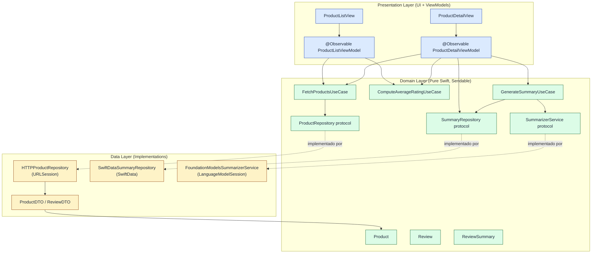
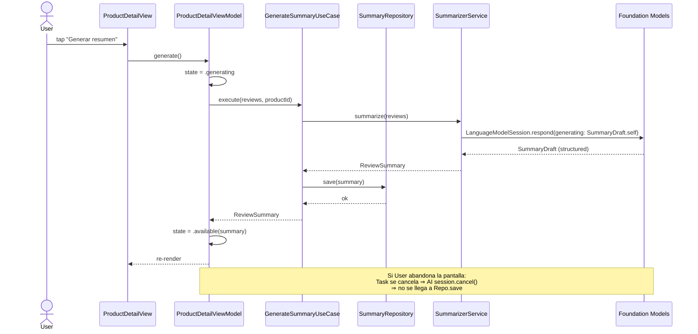

# Plan Técnico — AI Review Summarizer (iOS)

**Versión:** 1.1
**Fecha:** 2026-05-06
**Documento base:** `spec.md` v1.2 + Challenge Técnico (PDF)
**Alcance:** Decisiones de arquitectura, datos, AI, networking, persistencia, testing y estructura de carpetas para guiar la implementación.

**Cambios v1.1 (alineación con `spec.md` v1.2):**

- **RF-17**: las imágenes provienen de un repositorio público externo vía HTTPS (Picsum). Actualizado §1 (stack), §6.2 (contrato), §6.5 (ATS) y §10.5 (caché + fallback).
- **RNF-02**: la inferencia AI sigue 100 % on-device, pero la app sí realiza GETs HTTPS de imágenes a un host externo. Reformulado en §0 (resumen) y §10.5 para evitar la contradicción que existía en v1.0.
- **§11 (riesgos)**: nueva fila para indisponibilidad de Picsum durante la demo.
- **§12 (trazabilidad)**: agregada fila RF-17 y refinado el cruce con RNF-02.

---

## 0. Resumen Ejecutivo

App iOS nativa que lista productos desde un mock REST en localhost y genera resúmenes estructurados de reviews **íntegramente on-device** con Foundation Models Framework. Arquitectura **Clean Architecture liviana en 3 capas** (Presentation / Domain / Data) sobre **single app target organizado por carpetas**. Persistencia con **SwiftData**, networking con **URLSession + async/await**, UI en **SwiftUI + @Observable**, concurrencia **Swift 6 estricta**.

Decisiones guía:

- Pragmatismo sobre purismo: capas finas, sin abstracciones gratuitas.
- Frameworks nativos sobre dependencias externas: cero dependencias en MVP.
- **Inferencia AI 100 % on-device** (RNF-02 + RF-06): la generación de resúmenes funciona en modo avión. Ningún texto de reviews ni resultado de la AI sale del dispositivo.
- **Imágenes vía HTTPS público externo** (RF-17): el mock no aloja binarios; la app descarga imágenes directamente de Picsum. Tráfico anónimo, sin PII, separable y verificable en Proxyman.
- Cancelación correcta de toda task async (RNF-09, RF-15).

---

## 1. Stack Tecnológico Justificado

| Área | Elección | Justificación |
|---|---|---|
| **OS / SDK** | iOS 26+, SwiftUI, Swift 6 | iOS 26 es el mínimo para Foundation Models Framework (RNF-01). Swift 6 strict concurrency obligatoria por requerimiento. |
| **Concurrencia** | `async/await`, `Task`, actors | Modelo nativo, integrado con `Sendable`. Evitamos Combine (no es necesario para este alcance) y closures-based APIs. |
| **UI** | SwiftUI + `NavigationStack` + `@Observable` | Stack moderno, compatible con strict concurrency, declarativo. `@Observable` (Observation framework) reemplaza `ObservableObject` con mejor performance y menos boilerplate. |
| **AI on-device** | Foundation Models Framework | Único framework que cumple privacy-first del enunciado y es first-party. Soporta guided generation con `@Generable` para salidas estructuradas (4 secciones del resumen). |
| **Networking** | `URLSession` + `JSONDecoder` | Nativo, soporta `async/await` y cancelación cooperativa nativa. No se justifica Alamofire ni nada externo. |
| **Persistencia** | **SwiftData** | Nativo iOS 17+, integrado con Swift 6 (`@Model` es `Sendable` en uso correcto). Modelo de datos trivial (un entity: `PersistedSummary` indexado por `productId`). Más simple que Core Data, más estructurado que JSON files. |
| **Imágenes** | `AsyncImage` con `phase` | Las URLs apuntan a un repositorio público externo HTTPS (Picsum, RF-17). La variante de `AsyncImage` con `AsyncImagePhase` cubre placeholder, success y failure en un solo control nativo, satisfaciendo el requisito de fallback de RF-17 sin lógica custom. Caché HTTP por la `URLCache` compartida de `URLSession.shared` evita re-descargas dentro de la sesión. Si en el futuro se necesita prefetch on-scroll o caché persistente custom, se evaluaría Nuke/Kingfisher; en MVP no aplica. |
| **Configuración** | Build Setting `BACKEND_BASE_URL` + `Info.plist` resuelto en runtime | Sin recompilar (RF-01, RNF-07): se cambia vía xcconfig + Scheme override, leyendo `Info.plist` en `AppConfiguration`. Permite también override por launch argument para tests. |
| **Logging** | `os.Logger` (Unified Logging) | Subsystems por capa, niveles `debug`/`info`/`error`. Local only (RNF-11). |
| **Testing** | Swift Testing (`#expect`, `@Test`) | Framework moderno, paralelizable, sintaxis más limpia que XCTest. XCTest se mantiene si el equipo lo prefiere; ambos coexisten. |
| **Dependencias externas** | **Ninguna** en MVP | Cumplir "frameworks nativos sobre terceros" del enunciado. Single target, single repo, sin SPM packages locales. |

**Versiones objetivo:** iOS 26.0, Swift 6.0, Xcode 26.

---

## 2. Arquitectura

### 2.1 Justificación

**Clean Architecture liviana en 3 capas + MVVM** en presentación.

**Por qué Clean Architecture:**

- Separación clara de responsabilidades facilita testabilidad de la lógica de negocio (RN-01, RN-04, regla de umbral, cálculo de rating, política de regeneración).
- El dominio queda libre de SwiftUI, SwiftData y URLSession: testable con mocks puros.
- Reglas de dependencia: `Presentation → Domain ← Data`. El dominio no conoce a las otras capas.

**Por qué *liviana* (no canónica/estricta):**

- El alcance del MVP no justifica entidades + modelos de UI + DTOs + mappers en cascada para cada flujo. Mantenemos:
  - DTOs solo en la frontera de red.
  - Entidades de dominio puras (structs `Sendable`).
  - Modelos de UI **solo cuando difieren materialmente** de la entidad (ej. `ProductListItemUIModel` con rating ya formateado).
- No hay use cases triviales (un wrapper que llama directo al repo no aporta). Mantenemos use cases solo donde encapsulan lógica real (cálculo de rating, decisión de habilitar botón, política de regeneración).

**Por qué MVVM en presentación:**

- Encaja naturalmente con SwiftUI + `@Observable`.
- ViewModel mantiene UI state, View es declarativa y sin lógica de negocio.
- ViewModels son `@MainActor` por defecto (UI), llaman a use cases / repos en background con `Task`.

### 2.2 Diagrama de capas



### 2.3 Reglas de dependencia

- `Presentation` depende de `Domain`. **Nunca** de `Data`.
- `Data` depende de `Domain` (implementa sus protocolos).
- `Domain` no depende de nadie. Es Swift puro + `Foundation` (sin SwiftUI, sin SwiftData, sin URLSession).
- La composición ocurre en `App/CompositionRoot.swift` (DI manual, sin frameworks).

### 2.4 Diagrama de flujo: generación de resumen



---

## 3. Capas y Carpetas (Mapping)

| Capa | Carpeta | Contenido | Depende de |
|---|---|---|---|
| App | `App/` | `@main App`, `CompositionRoot`, `AppConfiguration` | Todas (composición) |
| Presentation | `Presentation/` | Views SwiftUI + ViewModels `@Observable` + UI models | Domain |
| Domain | `Domain/` | Entities, Use Cases, Repository protocols, errores | — (Foundation only) |
| Data | `Data/` | Implementaciones de repositorios, DTOs, mappers, sources (Network/Persistence/AI) | Domain |
| Core | `Core/` | Utilidades transversales (Logger, Configuration helpers) | — |
| Resources | `Resources/` | `Localizable.strings` (es), assets, mock JSON de Proxyman | — |

Estructura completa en §8.

---

## 4. Modelos de Datos

### 4.1 Entidades de Dominio (`Domain/Entities/`)

```swift
// Domain/Entities/Product.swift
public struct Product: Identifiable, Hashable, Sendable {
    public let id: String
    public let title: String
    public let imageURL: URL?
    public let reviews: [Review]
}

// Domain/Entities/Review.swift
public struct Review: Hashable, Sendable {
    public let author: String
    public let rating: Int        // 1...5 garantizado en mapping
    public let text: String
}

// Domain/Entities/ReviewSummary.swift
public struct ReviewSummary: Hashable, Sendable {
    public let productId: String
    public let sentiment: Sentiment
    public let strengths: [String]      // máx 5 (RF-07)
    public let weaknesses: [String]     // máx 5
    public let tagline: String          // ≤ 140 chars (RF-07)
    public let generatedAt: Date
}

public enum Sentiment: String, Sendable, CaseIterable {
    case positive
    case neutral
    case negative
}
```

**Notas de diseño:**

- Todas `Sendable` para Swift 6 strict concurrency.
- `id` es `String` para no acoplarnos a `Int`/`UUID`: el mock puede usar cualquiera (S-12).
- `imageURL` es opcional: si el DTO trae string inválido o vacío, se mapea a `nil` (no rompe el listado).
- `Sentiment` es enum cerrado (positive/neutral/negative) → match con guided generation.

### 4.2 DTOs (`Data/Network/DTOs/`)

```swift
// Data/Network/DTOs/ProductDTO.swift
struct ProductDTO: Decodable {
    let id: String
    let title: String
    let imageUrl: String?
    let reviews: [ReviewDTO]?
}

struct ReviewDTO: Decodable {
    let author: String
    let rating: Int
    let text: String
}
```

**Mapping (`Data/Network/Mappers/`):**

```swift
extension ProductDTO {
    func toDomain() -> Product {
        Product(
            id: id,
            title: title,
            imageURL: imageUrl.flatMap(URL.init(string:)),
            reviews: (reviews ?? [])
                .compactMap { $0.toDomain() }
        )
    }
}

extension ReviewDTO {
    func toDomain() -> Review? {
        // Filtrado defensivo: rating fuera de rango se descarta.
        guard (1...5).contains(rating) else { return nil }
        return Review(author: author, rating: rating, text: text)
    }
}
```

### 4.3 Modelo Persistido (`Data/Persistence/Models/`)

```swift
// Data/Persistence/Models/PersistedSummary.swift
import SwiftData

@Model
final class PersistedSummary {
    @Attribute(.unique) var productId: String
    var sentimentRaw: String
    var strengths: [String]
    var weaknesses: [String]
    var tagline: String
    var generatedAt: Date

    init(productId: String,
         sentimentRaw: String,
         strengths: [String],
         weaknesses: [String],
         tagline: String,
         generatedAt: Date) {
        self.productId = productId
        self.sentimentRaw = sentimentRaw
        self.strengths = strengths
        self.weaknesses = weaknesses
        self.tagline = tagline
        self.generatedAt = generatedAt
    }
}
```

**Mapping bidireccional** en `PersistedSummary+Mapping.swift`. `productId` único garantiza upsert correcto en regeneración (RF-09 / RN-03).

### 4.4 Modelos de UI (`Presentation/.../UIModels/`)

Solo donde aporta. Para la lista, formateamos rating una sola vez:

```swift
// Presentation/ProductList/UIModels/ProductListItemUIModel.swift
struct ProductListItemUIModel: Identifiable, Hashable, Sendable {
    let id: String
    let title: String
    let imageURL: URL?
    let reviewCount: Int
    let ratingDisplay: RatingDisplay
    let hasCachedSummary: Bool          // RF-10

    enum RatingDisplay: Hashable, Sendable {
        case value(String)              // "4.0"
        case unrated                    // "Sin calificación" (RF-03)
    }
}
```

Para el detalle, la entidad `Product` se usa directo (no agrega valor un UI model paralelo). El estado del resumen sí se modela como state machine en el ViewModel:

```swift
// Presentation/ProductDetail/UIModels/SummaryUIState.swift
enum SummaryUIState: Equatable {
    case none                           // No hay resumen ni tarea en curso
    case generating                     // Tarea AI activa
    case available(ReviewSummary)       // Resumen listo (cache o recién generado)
    case error(SummaryUIError)          // Falló generación
    case unsupported                    // RF-12: AI no disponible
    case disabledByThreshold(needed: Int) // RN-01: ≤5 reviews
}

enum SummaryUIError: Equatable {
    case generationFailed
    case timedOut
    case cancelled
}
```

Mapeo directo a los 7 estados de UI definidos en spec §6.2.

---

## 5. Estrategia de AI On-Device

### 5.1 Framework: Foundation Models

Elegimos **Foundation Models Framework** sobre Core ML por:

- Modelo de lenguaje generativo first-party de Apple, optimizado para Apple Silicon.
- API de alto nivel (`LanguageModelSession`) sin necesidad de empaquetar y mantener modelos custom.
- **Guided generation** con `@Generable` y `@Guide`: la salida estructurada (sentimiento + listas + tagline) se valida en el sistema de tipos. No parseamos texto libre.
- Integración nativa con `async/await` y cancelación cooperativa.

### 5.2 Detección de disponibilidad

Antes de habilitar el botón, el `SummarizerService` reporta disponibilidad:

```swift
// Domain/Services/SummarizerService.swift
public protocol SummarizerService: Sendable {
    var availability: SummarizerAvailability { get async }
    func summarize(reviews: [Review], productId: String) async throws -> ReviewSummary
}

public enum SummarizerAvailability: Sendable, Equatable {
    case available
    case unavailable(reason: UnavailabilityReason)
}

public enum UnavailabilityReason: Sendable, Equatable {
    case deviceNotEligible      // hardware/SO sin soporte
    case modelNotReady          // descarga / Apple Intelligence off
    case appleIntelligenceOff   // toggle del usuario
    case unknown
}
```

Implementación en `Data/AI/`:

```swift
// Data/AI/FoundationModelsSummarizerService.swift
import FoundationModels

final actor FoundationModelsSummarizerService: SummarizerService {
    var availability: SummarizerAvailability {
        get async {
            switch SystemLanguageModel.default.availability {
            case .available: return .available
            case .unavailable(.deviceNotEligible):
                return .unavailable(reason: .deviceNotEligible)
            case .unavailable(.appleIntelligenceNotEnabled):
                return .unavailable(reason: .appleIntelligenceOff)
            case .unavailable(.modelNotReady):
                return .unavailable(reason: .modelNotReady)
            @unknown default:
                return .unavailable(reason: .unknown)
            }
        }
    }
    // ...
}
```

El `ProductDetailViewModel` consulta `availability` al aparecer la pantalla. Si no está `.available`, el estado pasa a `.unsupported` y el botón se deshabilita con copy informativo (RF-12, CA-RF-12).

### 5.3 Diseño del prompt y output estructurado

**Schema de salida** (guided generation):

```swift
// Data/AI/Prompt/SummaryDraft.swift
import FoundationModels

@Generable(description: "Resumen estructurado en español de las reviews de un producto.")
struct SummaryDraft {
    @Guide(description: "Sentimiento general agregado de las reviews.")
    let sentiment: SentimentChoice

    @Guide(description: "Aspectos positivos recurrentes mencionados por los usuarios. Máximo 5 ítems, cada uno una frase corta.")
    @Guide(.count(0...5))
    let strengths: [String]

    @Guide(description: "Aspectos negativos recurrentes mencionados por los usuarios. Máximo 5 ítems, cada uno una frase corta.")
    @Guide(.count(0...5))
    let weaknesses: [String]

    @Guide(description: "Frase resumen de una sola línea, máximo 140 caracteres, en español neutro.")
    let tagline: String
}

@Generable
enum SentimentChoice: String {
    case positive
    case neutral
    case negative
}
```

**System instructions** (constantes, sin datos del producto):

```
Sos un asistente que resume reviews de productos de un marketplace.
Tu salida es siempre en español neutro, conciso y honesto.
Reglas:
- Si las reviews son contradictorias, indicá sentimiento neutral.
- No inventes información: solo citá aspectos que aparezcan en las reviews.
- Listás aspectos como frases cortas, no oraciones largas.
- Tagline: ≤ 140 caracteres, una sola línea, sin emojis.
- No saludes ni te despidas. Solo el resumen estructurado.
```

**User prompt** (datos por request):

```
Resumí las siguientes reviews del producto "<title>":

[1] ⭐4 — Juan: "El sonido es excelente pero la batería dura poco."
[2] ⭐5 — Ana:  "Muy buena calidad, lo recomiendo."
...
```

Construcción:

```swift
// Data/AI/Prompt/PromptBuilder.swift
struct PromptBuilder {
    static let systemInstructions = """
    Sos un asistente que resume reviews de productos...
    """

    static func userPrompt(productTitle: String, reviews: [Review]) -> String {
        let lines = reviews.enumerated().map { idx, r in
            "[\(idx+1)] ⭐\(r.rating) — \(r.author): \"\(r.text)\""
        }
        return """
        Resumí las siguientes reviews del producto "\(productTitle)":

        \(lines.joined(separator: "\n"))
        """
    }
}
```

**Llamada al modelo:**

```swift
func summarize(reviews: [Review], productId: String) async throws -> ReviewSummary {
    guard !reviews.isEmpty else { throw SummarizerError.noReviews }

    let session = LanguageModelSession(instructions: PromptBuilder.systemInstructions)
    let prompt = PromptBuilder.userPrompt(productTitle: /* ... */, reviews: reviews)

    let response = try await session.respond(
        to: prompt,
        generating: SummaryDraft.self
    )

    try Task.checkCancellation()  // Defensa adicional ante cancelación tardía.

    return response.content.toDomain(productId: productId)
}
```

`LanguageModelSession` es `Sendable` y la llamada es async cooperativa: si el `Task` se cancela (usuario abandona detalle), la API responde con `CancellationError`. El servicio lo propaga; el ViewModel lo trata como cancelación silenciosa (no muestra error).

### 5.4 Manejo de contexto excedido (RNF-12 / S-05)

El context window de Foundation Models es finito. Para 20 reviews cortas no debería ser problema, pero hay que defenderse de reviews largas. Estrategia en cascada:

1. **Intento 1 — full**: enviar todas las reviews tal cual.
2. **Si la API responde `exceededContextWindowSize`** (o equivalente):
   - **Truncar** cada review a un cap por longitud (ej. 600 chars), preservando inicio.
   - Reintentar.
3. **Si vuelve a fallar**:
   - **Map-reduce**: dividir en chunks de N reviews, generar sub-resúmenes, fusionar.
   - Por simplicidad de MVP, documentamos la estrategia pero implementamos solo (1) y (2). (3) queda como TODO trazado a RNF-12.

Esto se encapsula en el `FoundationModelsSummarizerService`, transparente al dominio.

### 5.5 Cancelación

- Toda llamada al servicio se realiza desde un `Task` bajo control del ViewModel.
- En `onDisappear` o cuando el ViewModel sale de scope, se invoca `task?.cancel()`.
- Foundation Models cooperative cancellation: la inferencia se aborta sin escribir resultado.
- El use case **no persiste** si la llamada lanzó `CancellationError`.

```swift
// Presentation/ProductDetail/ProductDetailViewModel.swift (extracto)
@MainActor
@Observable
final class ProductDetailViewModel {
    private var generationTask: Task<Void, Never>?

    func generateSummary() {
        generationTask?.cancel()
        generationTask = Task { [weak self] in
            guard let self else { return }
            self.summaryState = .generating
            do {
                let summary = try await self.generateSummaryUseCase.execute(
                    productId: product.id,
                    reviews: product.reviews
                )
                if Task.isCancelled { return }
                self.summaryState = .available(summary)
            } catch is CancellationError {
                // silencioso: usuario abandonó / canceló
            } catch {
                self.summaryState = .error(.generationFailed)
            }
        }
    }

    func onDisappear() {
        generationTask?.cancel()
    }
}
```

Cumple RF-11, RF-15, CA-RF-11, CA-RF-15.

### 5.6 Política de regeneración (RF-09 / RN-03)

`GenerateSummaryUseCase` siempre invoca `summarize` y luego **upsert** (`@Attribute(.unique)` en `productId` permite reemplazo limpio). En caso de error, **no toca** lo que ya estaba persistido (CA-RF-09: "si la regeneración falla, se conserva el resumen previo").

```swift
public final class GenerateSummaryUseCase: Sendable {
    private let summarizer: SummarizerService
    private let repository: SummaryRepository

    public func execute(productId: String, reviews: [Review]) async throws -> ReviewSummary {
        let summary = try await summarizer.summarize(reviews: reviews, productId: productId)
        try await repository.upsert(summary)  // solo si summarize tuvo éxito
        return summary
    }
}
```

---

## 6. Contratos de API

### 6.1 Endpoint

| Método | Path | Descripción |
|---|---|---|
| `GET` | `/products` | Lista 100+ productos con sus reviews embebidas. Sin paginación (S-06). |

Base URL configurable, default `http://localhost:9090` (Proxyman). Solo HTTP cuando host es `localhost` (RF-01, RNF-03).

### 6.2 Response — `GET /products`

**Status:** `200 OK`

```json
[
  {
    "id": "p_001",
    "title": "Auriculares Bluetooth XS-200",
    "imageUrl": "https://picsum.photos/seed/p_001/400/400",
    "reviews": [
      { "author": "Juan",  "rating": 4, "text": "Muy buen sonido, batería justa." },
      { "author": "Ana",   "rating": 5, "text": "Excelente relación calidad/precio." }
    ]
  }
]
```

**Garantías del mock:**

- `id` único y estable (S-12).
- `imageUrl` es URL absoluta HTTPS a un repositorio público externo (RF-17, S-13). El mock **no aloja binarios** de imágenes — solo los provee como string. La descarga la realiza la app contra el host externo.
- `reviews` array entre 0 y 20 elementos (PDF).
- `rating` entero `1...5` (PDF).
- 100+ productos en una sola respuesta.

### 6.3 Errores

| Caso | Tratamiento UI |
|---|---|
| `4xx` | Estado `error` con botón Reintentar (RF-13). |
| `5xx` | Estado `error` con botón Reintentar. |
| Timeout (`URLError.timedOut`) | Estado `error` con copy "Tiempo agotado". |
| Sin red (`URLError.notConnectedToInternet`) | Estado `error` con copy "Sin conexión al servidor mock". |
| JSON inválido | Estado `error` con copy genérico, log con `os.Logger`. |

### 6.4 Cliente HTTP

```swift
// Data/Network/HTTPClient.swift
protocol HTTPClient: Sendable {
    func get<T: Decodable>(_ path: String) async throws -> T
}

actor URLSessionHTTPClient: HTTPClient {
    private let session: URLSession
    private let baseURL: URL
    private let decoder: JSONDecoder

    init(baseURL: URL, session: URLSession = .shared) {
        self.baseURL = baseURL
        self.session = session
        self.decoder = JSONDecoder()
    }

    func get<T: Decodable>(_ path: String) async throws -> T {
        let url = baseURL.appending(path: path)
        let (data, response) = try await session.data(from: url)
        guard let http = response as? HTTPURLResponse else {
            throw NetworkError.invalidResponse
        }
        guard (200..<300).contains(http.statusCode) else {
            throw NetworkError.httpStatus(http.statusCode)
        }
        do {
            return try decoder.decode(T.self, from: data)
        } catch {
            throw NetworkError.decoding(error)
        }
    }
}

enum NetworkError: Error, Equatable {
    case invalidResponse
    case httpStatus(Int)
    case decoding(Error)
    case transport(Error)

    static func == (lhs: NetworkError, rhs: NetworkError) -> Bool { /* ... */ }
}
```

### 6.5 Configuración de URL base (RF-01)

```swift
// Core/Configuration/AppConfiguration.swift
struct AppConfiguration {
    let backendBaseURL: URL

    static func load() -> AppConfiguration {
        // 1. Override por launch argument (tests / QA).
        if let arg = ProcessInfo.processInfo.environment["BACKEND_BASE_URL"],
           let url = URL(string: arg) {
            return AppConfiguration(backendBaseURL: url)
        }
        // 2. Lectura de Info.plist (resuelto desde xcconfig).
        guard
            let raw = Bundle.main.object(forInfoDictionaryKey: "BackendBaseURL") as? String,
            let url = URL(string: raw)
        else {
            preconditionFailure("BackendBaseURL no configurada en Info.plist")
        }
        return AppConfiguration(backendBaseURL: url)
    }
}
```

`Info.plist`:

```xml
<key>BackendBaseURL</key>
<string>$(BACKEND_BASE_URL)</string>
<key>NSAppTransportSecurity</key>
<dict>
    <key>NSExceptionDomains</key>
    <dict>
        <key>localhost</key>
        <dict>
            <key>NSExceptionAllowsInsecureHTTPLoads</key>
            <true/>
        </dict>
    </dict>
</dict>
```

`xcconfig` por scheme: `BACKEND_BASE_URL = http://localhost:9090`. Para apuntar a otro mock, se cambia el xcconfig (no recompila configuración, solo build setting). Cumple RF-01 + CA-RF-01.

**Sobre ATS y hosts externos (RF-17):** la excepción de ATS aplica únicamente al endpoint del mock (`localhost`, HTTP). Las imágenes de Picsum se sirven por **HTTPS estándar**, por lo que **no requieren ninguna excepción adicional** en `Info.plist`. Esto preserva la postura de seguridad por defecto: cualquier intento futuro de servir imágenes desde un host HTTP no-localhost sería rechazado por ATS, lo cual es el comportamiento deseado.

---

## 7. Persistencia

### 7.1 Stack: SwiftData

- Modelo único: `PersistedSummary`.
- `@Attribute(.unique) var productId` → upsert directo, satisface RN-02 y RN-03.
- `ModelContainer` se inyecta en `CompositionRoot` y se pasa al repositorio.

### 7.2 Repositorio

```swift
// Domain/Repositories/SummaryRepository.swift
public protocol SummaryRepository: Sendable {
    func fetch(productId: String) async throws -> ReviewSummary?
    func fetchAllProductIds() async throws -> Set<String>     // para el badge "tiene resumen"
    func upsert(_ summary: ReviewSummary) async throws
    func delete(productId: String) async throws
}
```

```swift
// Data/Persistence/SwiftDataSummaryRepository.swift
import SwiftData

actor SwiftDataSummaryRepository: SummaryRepository {
    private let container: ModelContainer

    init(container: ModelContainer) {
        self.container = container
    }

    func fetch(productId: String) async throws -> ReviewSummary? {
        let context = ModelContext(container)
        let descriptor = FetchDescriptor<PersistedSummary>(
            predicate: #Predicate { $0.productId == productId }
        )
        return try context.fetch(descriptor).first?.toDomain()
    }

    func upsert(_ summary: ReviewSummary) async throws {
        let context = ModelContext(container)
        // Buscar existente
        let descriptor = FetchDescriptor<PersistedSummary>(
            predicate: #Predicate { $0.productId == summary.productId }
        )
        if let existing = try context.fetch(descriptor).first {
            existing.sentimentRaw = summary.sentiment.rawValue
            existing.strengths = summary.strengths
            existing.weaknesses = summary.weaknesses
            existing.tagline = summary.tagline
            existing.generatedAt = summary.generatedAt
        } else {
            context.insert(PersistedSummary(from: summary))
        }
        try context.save()
    }
    // fetchAllProductIds, delete análogos
}
```

### 7.3 Indicador "resumen disponible" (RF-10)

El `ProductListViewModel` carga, además de la lista de productos, el `Set<String>` de `productId` con resumen. Se cruzan en mapeo a `ProductListItemUIModel.hasCachedSummary`. Costo: una sola query de IDs al iniciar (la pantalla no se navega tan seguido como para necesitar caché en memoria adicional).

---

## 8. Estructura de Carpetas

```
ReviewSummarizer/
├── App/
│   ├── ReviewSummarizerApp.swift            # @main
│   ├── CompositionRoot.swift                # DI manual
│   └── AppConfiguration.swift               # carga URL base, etc.
│
├── Presentation/
│   ├── ProductList/
│   │   ├── ProductListView.swift
│   │   ├── ProductListViewModel.swift       # @Observable, @MainActor
│   │   ├── Components/
│   │   │   ├── ProductRowView.swift
│   │   │   └── RatingBadgeView.swift
│   │   └── UIModels/
│   │       └── ProductListItemUIModel.swift
│   ├── ProductDetail/
│   │   ├── ProductDetailView.swift
│   │   ├── ProductDetailViewModel.swift
│   │   ├── Components/
│   │   │   ├── ReviewRowView.swift
│   │   │   ├── SummarySectionView.swift
│   │   │   └── GenerateSummaryButton.swift
│   │   └── UIModels/
│   │       └── SummaryUIState.swift
│   └── Common/
│       ├── ErrorView.swift
│       ├── EmptyStateView.swift
│       └── LoadingView.swift
│
├── Domain/
│   ├── Entities/
│   │   ├── Product.swift
│   │   ├── Review.swift
│   │   └── ReviewSummary.swift
│   ├── UseCases/
│   │   ├── FetchProductsUseCase.swift
│   │   ├── ComputeAverageRatingUseCase.swift
│   │   ├── GenerateSummaryUseCase.swift
│   │   ├── GetCachedSummaryUseCase.swift
│   │   └── CanGenerateSummaryUseCase.swift  # RN-01: > 5 reviews
│   ├── Repositories/
│   │   ├── ProductRepository.swift          # protocol
│   │   └── SummaryRepository.swift          # protocol
│   ├── Services/
│   │   └── SummarizerService.swift          # protocol + availability
│   └── Errors/
│       └── DomainError.swift
│
├── Data/
│   ├── Network/
│   │   ├── HTTPClient.swift
│   │   ├── URLSessionHTTPClient.swift
│   │   ├── DTOs/
│   │   │   ├── ProductDTO.swift
│   │   │   └── ReviewDTO.swift
│   │   ├── Mappers/
│   │   │   └── ProductDTO+Mapping.swift
│   │   └── HTTPProductRepository.swift
│   ├── Persistence/
│   │   ├── Models/
│   │   │   └── PersistedSummary.swift
│   │   ├── Mappers/
│   │   │   └── PersistedSummary+Mapping.swift
│   │   └── SwiftDataSummaryRepository.swift
│   └── AI/
│       ├── FoundationModelsSummarizerService.swift
│       └── Prompt/
│           ├── SummaryDraft.swift           # @Generable
│           └── PromptBuilder.swift
│
├── Core/
│   ├── Logging/
│   │   └── Logger+Categories.swift          # os.Logger por capa
│   └── Extensions/
│       └── URL+Append.swift
│
└── Resources/
    ├── Assets.xcassets
    ├── Localizable.strings (es)
    ├── Info.plist
    └── Mocks/
        └── products.json                    # 100+ productos para Proxyman

ReviewSummarizerTests/
├── Domain/
│   ├── ComputeAverageRatingUseCaseTests.swift
│   ├── CanGenerateSummaryUseCaseTests.swift
│   ├── GenerateSummaryUseCaseTests.swift
│   └── FetchProductsUseCaseTests.swift
├── Data/
│   ├── ProductDTOMappingTests.swift
│   └── SwiftDataSummaryRepositoryTests.swift
├── Presentation/
│   ├── ProductListViewModelTests.swift
│   └── ProductDetailViewModelTests.swift
└── Doubles/
    ├── ProductRepositoryStub.swift
    ├── SummaryRepositorySpy.swift
    └── SummarizerServiceMock.swift
```

**Justificación de estructura:**

- Carpetas por feature dentro de `Presentation` → escalable (si se agregan pantallas, cada feature es self-contained).
- Capas top-level (`Domain`, `Data`, `Core`) → reglas de dependencia visibles solo viendo el árbol.
- `Doubles/` separados de los tests → reutilizables entre suites.
- Single target. Sin SPM. Sin sub-frameworks.

---

## 9. Estrategia de Testing

### 9.1 Pirámide

| Capa | Cobertura objetivo | Framework | Justificación |
|---|---|---|---|
| Domain (Use Cases, mappers) | **Alta (>80 %)** | Swift Testing | Lógica pura, fácil de cubrir, requerimiento explícito del enunciado. |
| Data (mappers DTO, repos) | Media | Swift Testing | Mapping defensivo + integración con SwiftData (in-memory). |
| Presentation (ViewModels) | Media | Swift Testing | Protege transiciones de estado de UI (loading→success→error). |
| UI (Views) | **Sin tests** | — | Excluido por enunciado / system prompt. Snapshot tests fuera de alcance. |

### 9.2 Use cases prioritarios

| Use Case | Tests clave |
|---|---|
| `ComputeAverageRatingUseCase` | `[5,4,3]` → 4.0; `[]` → `.unrated`; `[4]` → 4.0; redondeo a 1 decimal. **(CA-RF-03)** |
| `CanGenerateSummaryUseCase` | 0 → false; 5 → false; 6 → true; 20 → true. **(CA-RF-05)** |
| `GenerateSummaryUseCase` | éxito → upsert; error → no upsert; cancelación → no upsert + propaga `CancellationError`. **(CA-RF-09, CA-RF-15)** |
| `FetchProductsUseCase` | éxito → entidades mapeadas; rating fuera de rango filtrado; URL inválida → `imageURL = nil`. |

### 9.3 Repositorios y servicios

- `SwiftDataSummaryRepository`: container in-memory (`isStoredInMemoryOnly: true`). Tests de upsert, fetch, regeneración (mismo `productId` reemplaza).
- `FoundationModelsSummarizerService`: **no se testea unitariamente** (depende del modelo on-device, no determinista). Se testea contra un `SummarizerServiceMock` desde el use case.

### 9.4 ViewModels

```swift
@MainActor
@Test func generateSummary_setsAvailable_onSuccess() async {
    let summary = ReviewSummary.fixture()
    let useCase = GenerateSummaryUseCaseStub(result: .success(summary))
    let sut = ProductDetailViewModel(/* deps */)

    sut.generateSummary()
    await sut.waitForGenerationToFinish()  // helper de test

    #expect(sut.summaryState == .available(summary))
}

@MainActor
@Test func generateSummary_keepsPreviousSummary_onError() async {
    let previous = ReviewSummary.fixture()
    let useCase = GenerateSummaryUseCaseStub(result: .failure(SomeError()))
    let sut = ProductDetailViewModel(initialSummary: previous, /* deps */)

    sut.regenerateSummary()
    await sut.waitForGenerationToFinish()

    // CA-RF-09
    #expect(sut.summaryState == .error(.generationFailed))
    #expect(sut.lastKnownSummary == previous)
}
```

### 9.5 Test doubles

- `ProductRepositoryStub`: devuelve fixtures predefinidos; permite inyectar errores.
- `SummaryRepositorySpy`: registra llamadas a `upsert` para verificar que **no** se llama tras cancelación.
- `SummarizerServiceMock`: control fino de delays, errores, cancelación, disponibilidad.

### 9.6 Fixtures

```swift
extension Product {
    static func fixture(reviewCount: Int = 6) -> Product {
        Product(
            id: "p_test",
            title: "Producto Test",
            imageURL: URL(string: "http://localhost/img.jpg"),
            reviews: (0..<reviewCount).map { _ in Review.fixture() }
        )
    }
}

extension Review {
    static func fixture(rating: Int = 4) -> Review {
        Review(author: "Test", rating: rating, text: "Texto.")
    }
}
```

### 9.7 No se testea

- `URLSessionHTTPClient` directamente: se cubre con tests del repositorio inyectando `URLProtocol` stub si surge la necesidad. En MVP, suficiente con mocks a nivel use case.
- Foundation Models real: no determinista, no se testea unitariamente.
- SwiftUI Views: fuera de alcance.

---

## 10. Trade-offs Considerados

### 10.1 SwiftData vs Core Data vs JSON files

| Opción | Pros | Contras | Decisión |
|---|---|---|---|
| **SwiftData** | Nativa Swift 6, `@Model`, predicates type-safe, menos boilerplate | iOS 17+ (no es problema acá), API aún relativamente nueva con bugs ocasionales | ✅ **Elegida**. Modelo trivial, encaja perfecto. |
| Core Data | Maduro, bien documentado | Verbose, NSManagedObject mezcla con concurrency es delicado | Descartado: overkill. |
| JSON files | Cero dependencias, simplísimo | Sin queries, manejo de concurrencia manual, reinvención de upsert | Descartado: SwiftData es casi tan simple y más correcto. |

### 10.2 `@Observable` vs `ObservableObject`

`@Observable` (Observation framework, iOS 17+) es la dirección oficial: tracking más fino, sin `@Published`, mejor performance. Sin contras relevantes en este alcance. **Elegido.**

### 10.3 Single repo `ProductRepository` vs split

Se podría tener `ProductCatalogRepository` + `ReviewRepository`. Pero las reviews vienen embebidas en el endpoint de productos: separar artificialmente sería simulación. **Mantenemos `ProductRepository` único** que sirve productos con sus reviews. `SummaryRepository` sí va separado: tiene otra fuente (SwiftData) y otro ciclo de vida.

### 10.4 Use cases vs llamada directa al repositorio

Hay use cases triviales de un solo paso. Aun así los mantenemos cuando:

- Encapsulan lógica testable (`ComputeAverageRatingUseCase`, `CanGenerateSummaryUseCase`).
- Encapsulan orquestación (`GenerateSummaryUseCase` coordina `SummarizerService` + `SummaryRepository`).

`FetchProductsUseCase` es delgado (delega al repo) pero lo mantenemos por consistencia y para enriquecer en el futuro (ej. mezclar productos con flag `hasCachedSummary`). El costo es bajo, el beneficio (uniformidad de capa) razonable.

### 10.5 Imágenes externas: AsyncImage, caché y privacidad

Tras RF-17, las imágenes de productos provienen de un repositorio público externo vía HTTPS (Picsum como referencia). Implicaciones de diseño:

- **`AsyncImage` con `AsyncImagePhase`**: usamos la variante que expone el ciclo `.empty | .success | .failure` para resolver placeholder y fallback con un solo control nativo. Cumple "si la URL falla, se muestra placeholder" (RF-17, CA-RF-02) sin lógica custom.
- **Caché HTTP por defecto**: `URLSession.shared` ya viene con una `URLCache` en memoria + disco que respeta los headers de respuesta. Es suficiente para evitar re-descargas dentro de la sesión y entre relaunches recientes.
- **Privacidad (RNF-02 actualizado)**: el GET es anónimo y separable. La URL transporta solo un `seed` determinista por producto, sin PII ni texto de reviews ni resultado de la AI. Un evaluador puede confirmarlo en Proxyman: tráfico al dominio del mock = `localhost`; tráfico a `picsum.photos` = solo GETs de imágenes. Estos dos canales no se mezclan.
- **Sin Nuke/Kingfisher**: `AsyncImage` cubre los requisitos del MVP. Si en producción real se necesitara prefetch on-scroll, deduplicación de requests in-flight o invalidación selectiva de caché, sería razonable migrar a Nuke. **Para MVP, no.**

### 10.6 Combine

Descartado. SwiftUI + `@Observable` + `async/await` cubre todo el reactivo necesario. Combine añade complejidad de schedulers y se lleva mal con Swift 6 strict concurrency.

### 10.7 Strict concurrency: actor para repositorios vs `@MainActor`

- ViewModels: `@MainActor` (UI state).
- Repositorios y servicios: `actor`. Aislamiento explícito, `Sendable` en frontera, sin race conditions con SwiftData/URLSession.
- Use cases: `Sendable` structs/classes con métodos async; no aislados a un actor (no tienen estado mutable).

### 10.8 Manejo de "exceeded context" en AI

Se documenta estrategia 3-niveles (full → truncate → map-reduce). En MVP se implementan los dos primeros niveles. Map-reduce queda como **TODO trazado a RNF-12**: si en el set real el truncado a 600 chars × 20 reviews no entra, se prioriza implementarlo. La lógica es local al servicio AI, no propaga al dominio.

### 10.9 Disponibilidad de AI: poll vs push

`SystemLanguageModel.availability` se consulta on-demand al entrar al detalle. No mantenemos un observador continuo (Apple Intelligence no se enciende típicamente entre dos navegaciones). Si llegara a hacerse, se observa con `Task` que reaccione a notificaciones del sistema. Por ahora, **simple chequeo on-appear**.

### 10.10 i18n

Solo español (RNF-06, RN-09). Aun así, todos los strings van a `Localizable.strings`. Costo marginal cero, futura i18n trivial.

### 10.11 Configurabilidad de URL: xcconfig vs feature flag runtime

xcconfig + Info.plist requiere relanzar (CA-RF-01 lo permite explícitamente: "y relanzar la app"). Una pantalla de settings runtime sería más friendly pero está fuera de alcance del PDF. **Mantenemos xcconfig** + override por launch argument para QA/tests automatizados.

### 10.12 Logging remoto

Excluido (RNF-11: logs locales). `os.Logger` con categorías por capa: `network`, `persistence`, `ai`, `ui`.

---

## 11. Riesgos y Mitigaciones

| Riesgo | Probabilidad | Impacto | Mitigación |
|---|---|---|---|
| Foundation Models no disponible en el simulador del evaluador | Alta | Alto | Detectar y degradar con UX clara (RF-12). README documenta cómo testear en device real con Apple Intelligence on. |
| Context overflow con 20 reviews largas | Media | Medio | Truncado defensivo en `PromptBuilder`; estrategia documentada en §5.4. |
| Cambios de API de Foundation Models entre seeds de iOS 26 | Media | Medio | Aislar en `Data/AI/`; el dominio no se entera. |
| Locale del modelo no respeta español | Baja | Medio | System instructions explícitas + tests manuales en demo. Fallback no aplica (PDF / spec asumen español). |
| Tiempos de inferencia > 10 s en devices "compatibles pero lentos" | Media | Bajo | Indicador de progreso (RF-11). Cancelación al salir. RNF-04 ya marca el tiempo como objetivo, no SLA duro. |
| Caída o latencia alta de Picsum durante la demo | Media | Bajo | Placeholder nativo en `AsyncImage` (RF-17). El render de la lista no depende del éxito de la imagen: título, rating y conteo de reviews siguen visibles. Como respaldo previo a la grabación, se pre-warmea el cache navegando una vez antes. |

---

## 12. Checklist de Trazabilidad Spec ↔ Plan Técnico

| Spec | Cubierto por |
|---|---|
| RF-01 (URL configurable) | §6.5 |
| RF-02 / RF-03 (lista, rating) | §4.1, §4.4, §9.2 |
| RF-04 (detalle separado) | §3, §8 (`Presentation/ProductDetail/`) |
| RF-05 (umbral > 5) | `CanGenerateSummaryUseCase` §8, §9.2 |
| RF-06 / RF-07 (AI on-device, 4 secciones) | §5 entero |
| RF-08 / RF-09 (persistencia, regeneración) | §7, §5.6 |
| RF-10 (indicador en lista) | §4.4, §7.3 |
| RF-11 / RF-15 (cancelación) | §5.5 |
| RF-12 (fallback AI) | §5.2 |
| RF-13 / RF-14 (errores, estados UI) | §6.3, §4.4 |
| RF-16 (pull-to-refresh) | `ProductListView` (no detallado: SwiftUI `.refreshable`) |
| RF-17 (imágenes vía repo público externo) | §0 (resumen), §1 (stack), §6.2 (contrato), §6.5 (ATS), §10.5 (caché y placeholder), §11 (riesgo) |
| RNF-01 / RNF-03 | §1, §6.5 |
| RNF-02 (privacidad: AI on-device + imágenes anónimas) | §0, §5, §10.5 |
| RNF-04 / RNF-09 | §5.5, §11 |
| RNF-05 (a11y) | Resources + `accessibilityLabel` en componentes |
| RNF-06 / RN-09 (es) | §10.10 |
| RNF-08 (mantenibilidad) | §3, §8 |
| RNF-11 (logging) | §10.12 |
| RNF-12 (límites del modelo) | §5.4 |
| RN-01..RN-09 | §4, §5, §7, §9 |

---

**Fin del documento.**
